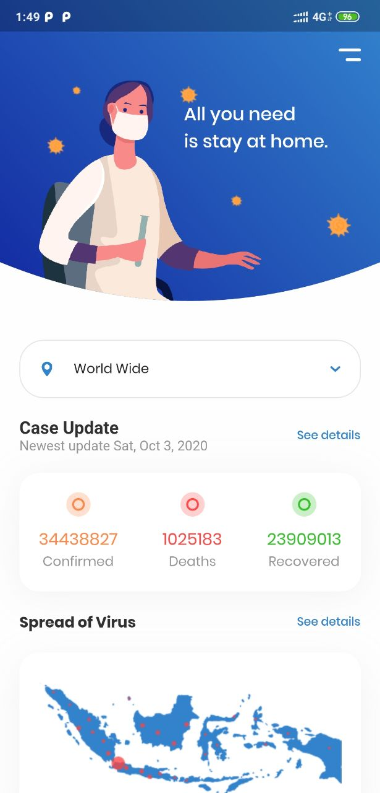

# Show some ❤️ and star the repo to support the project
# Covid Tracker

A Flutter app that tracks the present count of the number of Covid cases confirmed, recovered and the death numbers. 

## Screenshots
Home Page | Precautions
------------ | -------------
  | 
  
## Extras used
 * [API](https://covid19.mathdro.id/api)
 * [UI Inspiration](https://www.youtube.com/watch?v=zx6uMCoW2gQ&t=77s)
  

